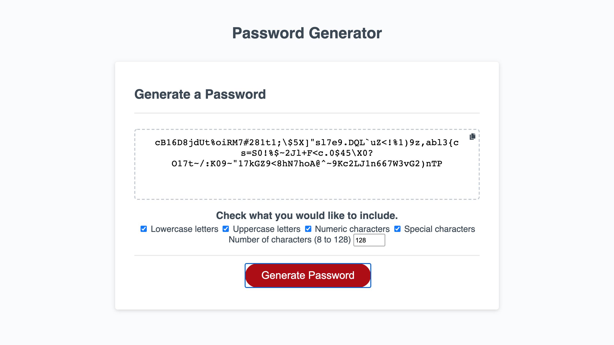

# Password Generator
Generates random passwords according to user inputs.

## Table of Contents
1. [ Description ](#desc)
2. [ Visuals ](#visuals)
3. [ Deployed Webpage ](#deployed)
4. [ Support ](#support)
5. [ Authors and Acknowledgement ](#acknowledge)
6. [ License ](#license)

## 1. Description
Generates random passwords according to the types of characters (i.e. numeric, special, uppercase, lowercase) the user chooses.

### Note:
For design and usability, I chose not to have dialog boxes.

### Summary of functionality
- the user can select checkboxes to determine which types of characters they would like in their password
- the user can enter in the input box how many characters they would like in their password (8 through 128)
- the user can copy the created password by clicking a button in the upper right corner

## 2. Visuals
Screenshot of the webpage:

## 5. Deployed Webpage
[The deployed site](https://tasha876.github.io/Password-Generator/), hosted by GitHub Pages.

## 4. Support
Should you find an issue with this webpage, please create a [new issue](https://github.com/Tasha876/Password-Generator/issues/new/choose) on my GitHub repository.

## 3. Authors and Acknowledgement
The code in this project was created by Natasha Fray. The design was created by the instructors at the [U of T Coding Bootcamp](https://bootcamp.learn.utoronto.ca/)

## 6. License
This project is covered by the [MIT](license) license.

